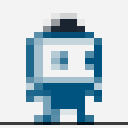
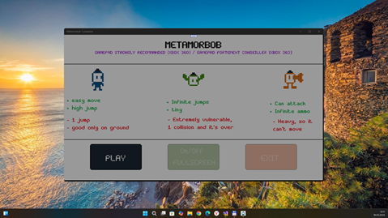
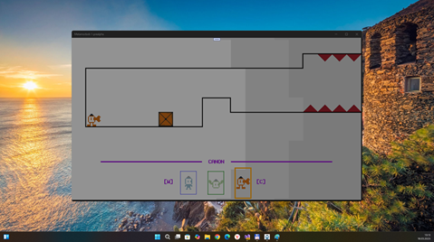
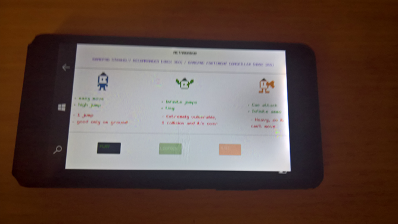
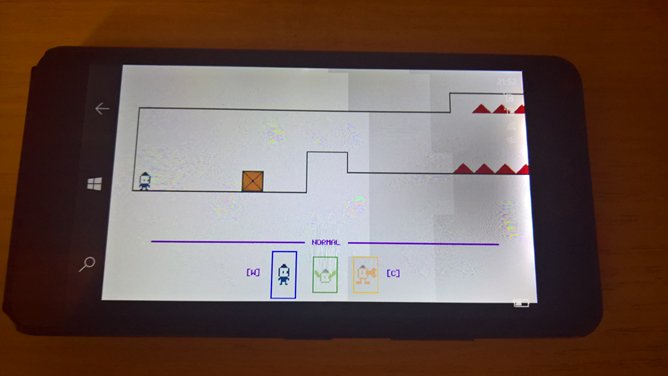
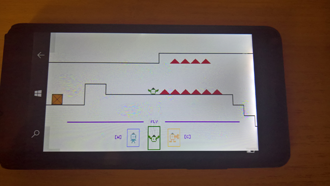

# Metamorbob 1.0-prealpha - uwp branch 

Remake of ITCH.io Metamorbob game project.

## About
"3 unique capacities, 5 levels and 1 boss, Can you reach the end in this perma-death adventure?"

## Screenshots

## Tech details
- God mode enabled ("hardcoded") to simplify game mechanics research
- UWP app : Min Win. SDK is 10240, Main Win. SDK is 19041  
- Only Lumia 640 tested, and Windows 11 desktop (Fullscreen mode)
- Work in progress

## Game control via Touch panel
- Tap screen : "simple touch" (start game / jump / fire)
- Tap screen left : Left move
- Tap screen right : Right move
- Tap screen top : Top move
- Tap screen bottom : Down move
- Swipe left (two-finger tap and move left) : change "player form" ("metamorphose")

## ToDo
- Realize normal screen scaling ...

## .
As is. No support. DIY. Learn purposes only.

## Reference(s)
https://hydrogene.itch.io/metamorbob Original project

## ..
[m][e] March 2025
